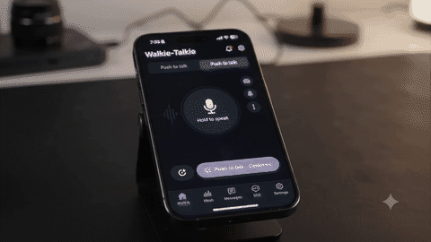
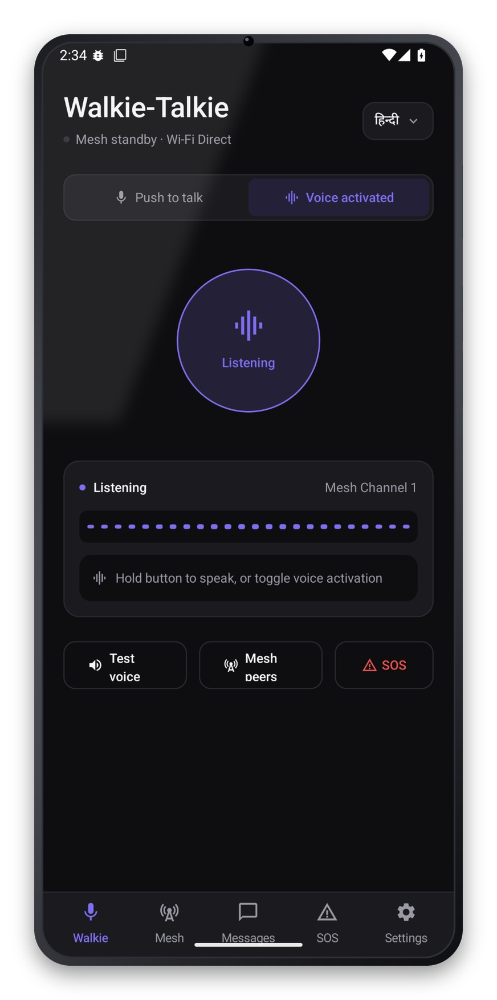
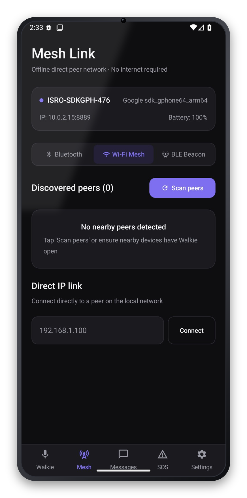
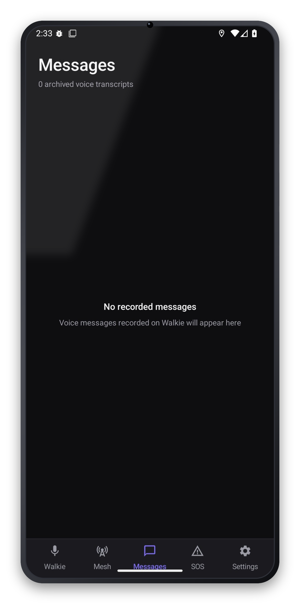
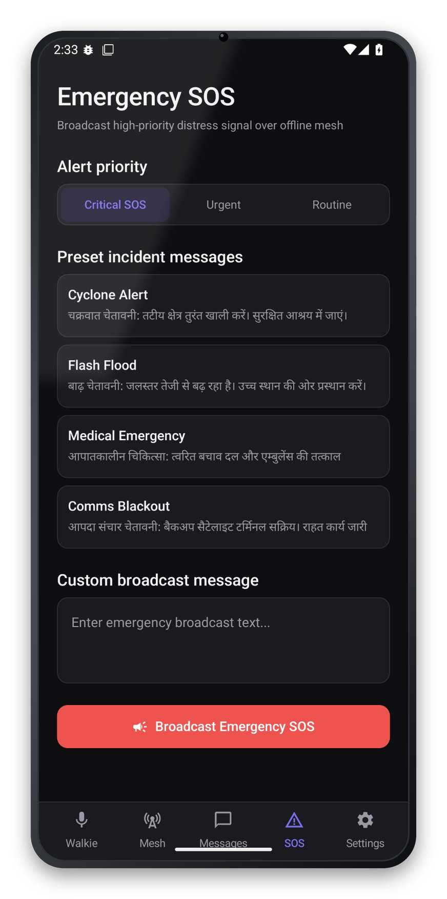
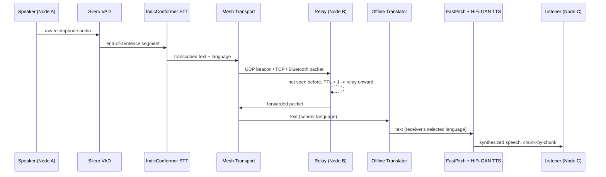
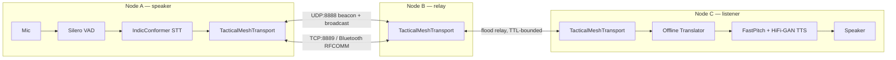

<div align="center">

# iTantra

### Offline, mesh-networked voice walkie-talkie for disaster response — in 10 Indian languages.

No internet. No cell towers. No cloud. Speak in your language, the person on the other end hears it in theirs — relayed phone-to-phone over Wi-Fi Direct, Bluetooth and BLE.

[](https://kotlinlang.org)
[](https://developer.android.com/jetpack/compose)
[](https://developer.android.com/)
[](https://onnxruntime.ai/)
[](LICENSE)

[](https://github.com/Kavyadharshini-S-M/iTantra/stargazers)
[](https://github.com/Kavyadharshini-S-M/iTantra/commits/main)
[](https://github.com/Kavyadharshini-S-M/iTantra)
[](https://github.com/Kavyadharshini-S-M/iTantra/issues)

<br/>

<table>
<tr>
<td align="center"><b>10</b><br/><sub>Indian languages</sub></td>
<td align="center"><b>3</b><br/><sub>Mesh transports</sub></td>
<td align="center"><b>0</b><br/><sub>Network calls for speech</sub></td>
<td align="center"><b>∞</b><br/><sub>Relay hops (TTL-bounded)</sub></td>
</tr>
</table>

</div>

<br/>

## Demo

<div align="center">



<sub>GIF preview (no audio) — [watch the full video with sound](docs/demo.mp4).</sub>

</div>

## Table of contents

- [Demo](#demo)
- [Why](#why)
- [Features](#features)
- [Screenshots](#screenshots)
- [How it works](#how-it-works)
- [Architecture](#architecture)
- [Tech stack](#tech-stack)
- [Supported languages](#supported-languages)
- [Getting started](#getting-started)
- [Project structure](#project-structure)
- [Models & credits](#models--credits)
- [Contributing](#contributing)
- [License](#license)

## Why

When a cyclone knocks out cell towers and the internet along a coastline, rescue teams and villagers still need to talk to each other — and not everyone in the affected region speaks the same language. iTantra turns any two (or more) Android phones into a walkie-talkie network that:

- needs **zero infrastructure** — no SIM, no Wi-Fi router, no data connection,
- **speaks and listens in the local language** on each end, translating in between,
- keeps working as a **multi-hop mesh** so a message can travel A → B → C even when A and C are out of each other's range,
- and can blast a **priority distress alert** to every connected node at once.

Built for the Smart India Hackathon around a disaster-management / space-comms (ISRO-styled) brief.

## Features

| | |
|---|---|
| **Offline speech pipeline** | On-device STT ([AI4Bharat IndicConformer](https://github.com/AI4Bharat/NeMo), INT8) with [Silero VAD](https://github.com/snakers4/silero-vad) for real-time sentence boundaries, and on-device TTS ([AI4Bharat Indic-TTS](https://github.com/AI4Bharat/Indic-TTS) FastPitch + HiFi-GAN) — zero network calls, ever. |
| **Streaming synthesis** | Long messages are chunked sentence-by-sentence and played back as each chunk finishes synthesizing, instead of waiting for the whole utterance to render before any sound plays. |
| **Cross-language relay** | The sender speaks their language; the receiver hears it in *theirs* — translated automatically in between. |
| **True mesh transport** | UDP broadcast discovery, TCP over Wi-Fi Direct, Bluetooth RFCOMM, and BLE scan/advertise, all live at once. |
| **Multi-hop relay** | A node holds every live link simultaneously and flood-relays unseen packets onward (TTL-bounded, dedup-cached) — two out-of-range phones can still talk through a third. |
| **Priority distress broadcast** | One tap sends a `CRITICAL_DISTRESS` packet to the whole mesh with a siren tone, forced max volume, and a haptic pattern. |
| **Push-to-talk or hands-free** | Classic PTT, or continuous VAD-segmented "phone mode" conversation. |
| **Per-device role** | Transceiver / STT-only / TTS-only — for mixed hearing- and speaking-impaired deployments. |
| **Mission voice log** | Every message sent and received is archived locally (Room) with language, timestamp, and alert priority. |
| **Live tactical telemetry** | Battery, signal strength, link quality, RSSI, local IP, RAM — always on screen. |

## Screenshots

<div align="center">
<table>
<tr>
<td align="center" width="20%"><br/><b>Walkie-Talkie</b><br/><sub>Push-to-talk & voice-activated modes</sub></td>
<td align="center" width="20%"><br/><b>Mesh Link</b><br/><sub>Peer discovery over Wi-Fi/BT/BLE</sub></td>
<td align="center" width="20%"><br/><b>Messages</b><br/><sub>Archived voice transcripts</sub></td>
<td align="center" width="20%"><br/><b>Emergency SOS</b><br/><sub>Priority distress broadcast</sub></td>
<td align="center" width="20%"><br/><b>Settings</b><br/><sub>On-device model status</sub></td>
</tr>
</table>
</div>

## How it works



## Architecture



A is out of Bluetooth/Wi-Fi Direct range of C, but both are linked to B — B holds both links simultaneously and relays A's packet on to C without either endpoint configuring anything.

## Tech stack

<table>
<tr><td><b>Language</b></td><td>


</td></tr>
<tr><td><b>UI</b></td><td>


</td></tr>
<tr><td><b>Architecture</b></td><td>


</td></tr>
<tr><td><b>Persistence</b></td><td>


</td></tr>
<tr><td><b>Speech-to-Text</b></td><td>

-orange)

</td></tr>
<tr><td><b>Voice Activity Detection</b></td><td>


</td></tr>
<tr><td><b>Text-to-Speech</b></td><td>


</td></tr>
<tr><td><b>Mesh networking</b></td><td>


</td></tr>
<tr><td><b>Min / target SDK</b></td><td>


</td></tr>
</table>

## Supported languages

| Language | Native | STT | TTS |
|---|---|:---:|:---:|
| Hindi | हिन्दी | ✅ | ✅ |
| Bengali | বাংলা | ✅ | ✅ |
| Marathi | मराठी | ✅ | ✅ |
| Telugu | తెలుగు | ✅ | ✅ |
| Tamil | தமிழ் | ✅ | ✅ |
| Gujarati | ગુજરાતી | ✅ | ✅ |
| Kannada | ಕನ್ನಡ | ✅ | ✅ |
| Malayalam | മലയാളം | ✅ | ✅ |
| Odia | ଓଡ଼ିଆ | ✅ | ✅ |
| English | English | — | ✅ |

New languages are added purely by dropping converted model files into `assets/models/<code>/` and a manifest entry — see `tools/model_conversion/`.

## Getting started

**Prerequisites:** [Android Studio](https://developer.android.com/studio) (Ladybug or newer), JDK 17.

```bash
git clone https://github.com/Kavyadharshini-S-M/iTantra.git
cd iTantra
```

### Model weights

The on-device STT/TTS model weights (~2.3GB across 10 languages) are **not** committed to this repo — several individual files exceed GitHub's 100MB limit. The manifest (`app/src/main/assets/models/model_manifest.json`), tokenizer vocabularies, and TTS frontend configs *are* included, describing exactly which upstream checkpoints each language pack expects and where they came from.

To run the app with real speech, regenerate the ONNX weights with the conversion scripts under `tools/model_conversion/` (`convert_stt.py`, `export_tts.py`) against the source checkpoints listed per-language in `model_manifest.json`, and drop the output into the matching `assets/models/<code>/stt/` and `assets/models/<code>/tts/` folders. Without them, a language simply reports itself as unavailable instead of faking a result — the app runs fine, it just has nothing to say yet.

### Build & run

1. Open the project root in Android Studio and let it sync.
2. Run on two physical devices (or a device + emulator) on the same Wi-Fi network / with Bluetooth enabled, to actually exercise the mesh.
3. Grant microphone, location, and nearby-devices/Bluetooth permissions when prompted — they're required for `RECORD_AUDIO`, Wi-Fi Direct discovery, and BLE/Bluetooth scanning respectively.

## Project structure

```
app/src/main/java/com/example/
├── stt/            # IndicConformer + Silero VAD speech-to-text engine
├── tts/            # FastPitch + HiFi-GAN text-to-speech engine
├── transport/      # UDP/TCP/Bluetooth/BLE/Wi-Fi Direct mesh transport
├── translation/    # Offline sender-language → receiver-language translation
├── model/          # Bundled model manifest loading & verification
├── data/           # Room database (mission voice log)
├── audio/          # Alert siren, haptics, audio focus management
├── viewmodel/      # MissionControlViewModel — app state & orchestration
└── ui/             # Compose screens & components
tools/model_conversion/  # Scripts to (re)export STT/TTS checkpoints to ONNX
```

## Models & credits

| Component | Source | License |
|---|---|---|
| STT acoustic model | [AI4Bharat IndicConformer](https://huggingface.co/ai4bharat) (via [trysem/indicconformer-120m-onnx](https://huggingface.co/trysem)) | CC-BY-4.0 |
| VAD | [Silero VAD](https://github.com/snakers4/silero-vad) | MIT |
| STT/VAD runtime | [sherpa-onnx](https://github.com/k2-fsa/sherpa-onnx) (k2-fsa) | Apache-2.0 |
| TTS acoustic + vocoder | [AI4Bharat Indic-TTS](https://github.com/AI4Bharat/Indic-TTS) (FastPitch + HiFi-GAN) | MIT |
| TTS/general ONNX runtime | [ONNX Runtime Mobile](https://onnxruntime.ai/) (Microsoft) | MIT |

## Contributing

Issues and PRs are welcome — additional language packs and mesh-transport hardening are good starting points.

## License

App source code is [MIT licensed](LICENSE). Bundled third-party models and libraries retain their own upstream licenses (see table above).

<div align="center">
<br/>

[](https://star-history.com/#Kavyadharshini-S-M/iTantra&Date)

<sub>If iTantra is useful to you, consider starring the repo.</sub>

</div>
